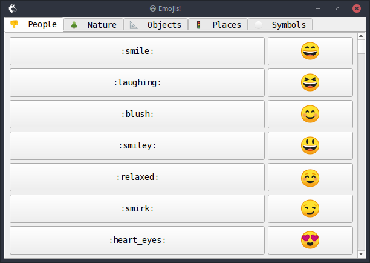
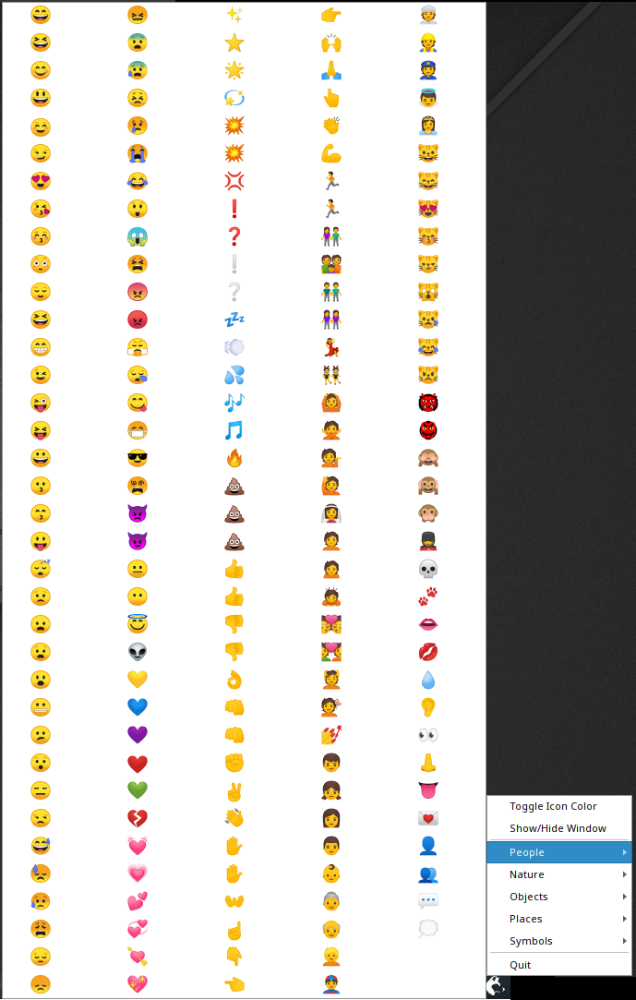

# Emoji Picker
Just click to copy your Emoji

Built with [nodegui](https://github.com/nodegui/nodegui) and [nodegui-starter](https://github.com/nodegui/nodegui-starter)


## Screenshots
### App Window:

### System Tray:



## To Use

To clone and run this repository you'll need [Git](https://git-scm.com) and [Node.js](https://nodejs.org/en/download/) (which comes with [npm](http://npmjs.com)) installed on your computer.

Make sure you have met the requirements listed here: https://docs.nodegui.org/#/tutorial/development-environment

From your command line:

```bash
# Clone this repository
git clone https://github.com/slidinghotdog/emoji-picker
# Go into the repository
cd emoji-picker
# Install dependencies
npm install
# Run the app
npm start

# Or create an executable file for your platform
npm run pack
```

## License

MIT
